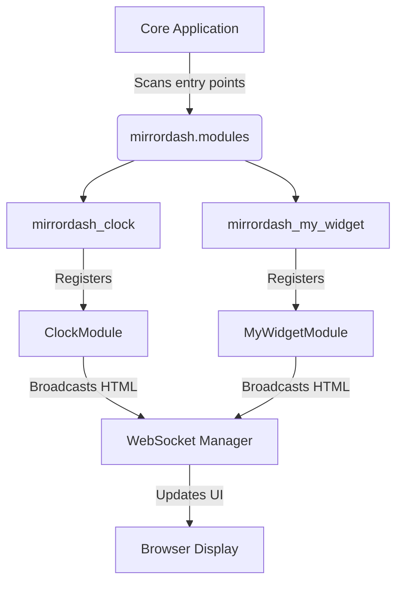

# Module Development Guide

The reference for building MirrorDash modules. To get going, use the quick start in the
[README](README.md#quick-start): `uvx mirrordash-sdk quickstart mirrordash-my-widget` creates a module,
sets up a local mirror with it and opens it. Come back here when you need the details.

> Your module's `run_loop` sends HTML with `broadcast_func`. Fetch data with `self.fetch_json`, show it
> with the building blocks in §7, keep files in `self.data_dir` (kept) or `self.cache_dir` (may be cleared),
> and describe its settings in `config_schema.json` to get a form in the admin page.
>
> `fetch_json` and the building blocks need MirrorDash 0.5 or newer (`dev-setup` installs it).

## Table of Contents

- [2. Plugin Class](#2-plugin-class)
- [2b. Fetching Data](#2b-fetching-data)
- [3. File Storage](#3-file-storage)
- [4. HTML Templates (Jinja2)](#4-html-templates-jinja2)
- [5. Inter-Module Communication (Event Bus)](#5-inter-module-communication-event-bus)
- [6. Config Schema (Admin UI)](#6-config-schema-admin-ui)
- [7. Styling Guidelines](#7-styling-guidelines)
- [8. Building & Publishing](#8-building--publishing)
- [9. Documentation Guidelines (`README.md`)](#9-documentation-guidelines-readmemd)
- [10. Installing on the Device](#10-installing-on-the-device)
- [Appendix: Architecture Overview](#appendix-architecture-overview)

---

## 2. Plugin Class

Every module is a Python class with two required methods.

```python
import asyncio
import logging

logger = logging.getLogger("mirrordash.modules.my_widget")

class MyWidgetModule:
    config_schema = {
        "title": "My Widget",
        "description": "Displays something cool on the mirror.",
        "properties": {
            "interval": {
                "type": "integer", "default": 60,
                "title": "Refresh Interval", "description": "Seconds between updates."
            }
        }
    }

    def __init__(self, config):
        self.config = config
        self.name = "mirrordash_my_widget"
        self.interval = config.get("interval", 60)
        self.data_dir = config.get("data_dir")   # persistent storage (backed up)
        self.cache_dir = config.get("cache_dir")  # transient storage (excluded from backups)

    async def run_loop(self, broadcast_func):
        while True:
            try:
                # Render HTML using the auto-injected Jinja2 helper (see §4)
                html = self.render_template("widget.html", value="Hello Mirror!")
                await broadcast_func(self.name, html)
            except Exception as e:
                logger.error(f"Error in {self.name}: {e}")
            await asyncio.sleep(self.interval)
```

### Lifecycle

| Method | Purpose |
|--------|---------|
| `__init__(self, config)` | Receives the module's config dict from `config.json`. Store any settings you need. `self.render_template` and `self.translate` are added after `__init__` returns, so don't call them here. |
| `run_loop(self, broadcast_func)` | Loop forever and broadcast HTML updates. Started when the mirror starts, again after a crash or if it returns, and on a fresh instance every time the settings are saved (each save stops and recreates all modules). |

`broadcast_func(name, html)` puts `html` in the module's place on the screen. The first argument is kept for compatibility and ignored; the core uses the instance id.

If you define a **synchronous** `run_loop` (no `async`), the core loader will automatically run it in a background thread so it won't block the event loop. Sync mode is fine for simple modules, but async is recommended.

### Crash Recovery

To ensure high ambient reliability, the MirrorDash backend runs each module's `run_loop` inside an auto-restarting recovery wrapper (`run_with_recovery`).
- **Auto-restart**: If your module throws an unhandled exception inside its run loop, it will be automatically restarted.
- **Exponential Backoff**: To protect resources and prevent infinite crash loops, restarts delay by an exponential backoff starting at `5` seconds, doubling on each subsequent crash (`10s`, `20s`, `40s`, etc.), up to a maximum delay cap of `300` seconds (5 minutes).
- **Backoff Reset**: The backoff delay resets back to `5` seconds once the module runs successfully without crashing.

### Global Settings

The core loader automatically injects a `globals` dictionary into the module's `config` parameter under the `"globals"` key. This dictionary contains system-wide configuration preferences (configured in the Admin Dashboard or `config.json`) that all modules can fall back to.

Supported global configuration keys include:

| Key | Type | Example / Format | Purpose |
|-----|------|-----------------|---------|
| `language` | `string` | `"en"`, `"sv"`, `"de"` | Preferred language for localization. |
| `timezone` | `string` | `"Europe/Stockholm"` | Timezone name for date and time calculations (e.g. standard `zoneinfo`). |
| `time_format` | `string` | `"24h"`, `"12h"` | Standard clock representation. |
| `temperature_unit` | `string` | `"C"`, `"F"` | Standard scale for thermometer widgets. |
| `distance_unit` | `string` | `"km"`, `"miles"` | Standard scale for distances/travel. |
| `latitude` | `number` | `59.3293` | Latitude decimal coordinates for weather or astronomy APIs. |
| `longitude` | `number` | `18.0686` | Longitude decimal coordinates. |

#### Using Globals for Fallback Values

> [!IMPORTANT]
> **Always Respect Global Settings:** To ensure a consistent and cohesive user experience across the mirror HUD, all modules must respect and inherit settings defined under the global configuration block. If your module formats dates, displays times, shows temperatures or distances, translates text, or uses geographic coordinates, you must query these global settings first before falling back to any hardcoded default value.

We recommend checking for module-specific config values first, falling back to the global settings, and finally falling back to a hardcoded default:

```python
def __init__(self, config):
    global_cfg = config.get("globals", {})
    
    # Instance config takes precedence, otherwise fall back to global
    self.time_format = config.get("format") or global_cfg.get("time_format", "24h")
    
    # Load timezone from globals, defaulting to Stockholm
    self.timezone_name = global_cfg.get("timezone", "Europe/Stockholm")
```

### Localization / Translations

MirrorDash supports optional localized text using JSON translation files. The core automatically scans for a `translations/` directory inside your package and loads translation dictionaries dynamically.

#### Directory Structure

Place translation files in a `translations/` folder at the root of your package:

```
mirrordash-my-widget/
├── mirrordash_my_widget/
│   ├── translations/
│   │   ├── en.json       # Fallback translations (Required)
│   │   └── sv.json       # Swedish translations (Optional)
│   ├── templates/
│   │   └── widget.html
│   ├── __init__.py
│   └── plugin.py
```

Translation files must be standard JSON objects containing key-value mappings. For example, `en.json`:
```json
{
  "title": "My Widget",
  "last_checked": "Last checked"
}
```

#### How it works

1. The core first loads the fallback `en.json` (English).
2. The core then checks the global user preference `globals.language`. If it is set to something else (e.g., `"sv"`), the core loads `sv.json` and merges it over the English base. This guarantees that missing translation keys always fall back cleanly to English.
3. The merged dictionary is injected into your config parameters as `translations` and attached to your module instance as `self.translations`.
4. A translation helper method is also attached: `self.translate(key, default)`.

#### Using Translations in Templates

When rendering templates, `translations` is **automatically injected** into your Jinja2 rendering context. You can reference keys directly:

```html
<div class="my-widget">
    <h2>{{ translations.get("title", "Fallback Title") }}</h2>
    <p>{{ translations.get("last_checked", "Checked") }}: {{ current_time }}</p>
</div>
```

#### Using Translations in Python Code

If you need a translated string inside your Python loop, use the injected `self.translate(key, default=None)` helper:

```python
def run_loop(self, broadcast_func):
    status_label = self.translate("last_checked", "Checked")
    logger.info(f"Using translation: {status_label}")
```

> [!NOTE]
> **Fallback Behavior**:
> - If the translation key exists in active/fallback language files, the translated string is returned.
> - If the key is missing and a `default` is specified, it returns the `default` value.
> - If the key is missing and `default` is `None` (or omitted), it falls back to returning the `key` string itself (e.g., `self.translate("my_key")` returns `"my_key"`).

---

## 2b. Fetching Data

The mirror gives every module `self.fetch_json` (added after `__init__`, like `render_template`). Use it
instead of your own HTTP code: it has a timeout, runs without blocking the mirror, and remembers the last
good answer, so the module keeps showing data when the internet is gone, even after a restart.

```python
data, error = await self.fetch_json(
    "https://api.example.com/v1/current",
    headers={"Authorization": f"Bearer {self.config['api_key']}"},  # keys go in headers
    params={"q": self.config["location"]},                           # becomes ?q=…
    timeout=10,
)
```

| `error` | Meaning | `data` |
| :--- | :--- | :--- |
| `None` | It worked. | The JSON answer. |
| `"rejected"` | 401/403: usually a wrong or missing API key. | The last good answer, or `None`. |
| `"offline"` | No answer: no internet, the service is down, or the timeout passed. | The last good answer, or `None`. |
| `"http <code>"` | Any other HTTP error, e.g. `"http 429"` (too many requests). | The last good answer, or `None`. |
| `"invalid"` | The answer wasn't JSON. | The last good answer, or `None`. |

- **Keys in headers, not in the URL**: the mirror logs only the host and path of a failed fetch, and never
  headers, so a key in a header never reaches the logs. Most APIs accept one (`Authorization`, `X-Api-Key`).
- **Say what is wrong on the screen**: show `data` when you have it, and a `.module-message` line when
  `error` is set (see §7), for example "Couldn't update. Last updated 14:05.". The `api` template does this.
- **No retries**: a failed fetch is tried again at the next `interval`. Keep the interval within the
  service's request limits.
- **Tests**: replace it with a fake: `module.fetch_json = AsyncMock(return_value=({"value": 21}, None))`.

---

## 3. File Storage

The mirror OS runs on a **read-only OverlayFS** to protect the SD card. Never write files inside your package directory.

The system's central configuration and write-accessible directories are located in the user's home directory:

| Path | Config key | Backed up? | Use for |
|------|-----------|-----------|---------|
| `~/.mirrordash/data/config.json` | N/A | ✅ Yes | Global mirror settings, modules activation & settings (resolves to environment `MYMM_CONFIG_PATH` if set, or falls back to local repo in dev mode) |
| `~/.mirrordash/data/<module>` | `data_dir` | ✅ Yes | SQLite DBs, user settings, persistent state |
| `~/.mirrordash/cache/<module>` | `cache_dir` | ❌ No | Downloaded icons, API response cache, temp files |

```python
import os

def __init__(self, config):
    self.data_dir = config.get("data_dir")
    self.cache_dir = config.get("cache_dir")

    self.db_path = os.path.join(self.data_dir, "data.db") if self.data_dir else None
    self.icon_path = os.path.join(self.cache_dir, "icon.png") if self.cache_dir else None
```

---

## 4. HTML Templates (Jinja2)

`jinja2` is pre-installed in the MirrorDash environment. The recommended approach is to keep your HTML in a `templates/` folder inside your package.

### Auto-injected helper (recommended)

If your package contains a `templates/` folder, the core loader automatically injects a `self.render_template(name, **ctx)` helper — no setup needed:

```python
async def run_loop(self, broadcast_func):
    while True:
        html = self.render_template("widget.html", value="Dynamic Content")
        await broadcast_func(self.name, html)
        await asyncio.sleep(self.interval)
```

#### Auto-injected Context Variables

When you invoke `self.render_template(template_name, **context)`, the core loader automatically injects the following context variables for you:
- **`translations`**: The merged dictionary containing localized strings for the current active language (merged over the fallback English base).
- **`show_header`**: A boolean (`True` or `False`) reflecting whether the user wants this module's header shown on the screen (defaults to `True`). You should use this to conditionally render your header (e.g., `<h2 class="module-header label-caps">{{ translations.get("title") }}</h2>`).

### Inline template (quick & simple)

For small snippets, use `jinja2.Template` directly in your Python file:

```python
from jinja2 import Template

TEMPLATE = Template("""
<div class="my-widget">
    <h2 class="module-header">My Widget</h2>
    
        <div class="display-xl">{{ value }}</div>
    
        <p class="text-secondary">Loading...</p>
    
</div>
""")

# In run_loop:
html = TEMPLATE.render(value="42°")
```

> [!NOTE]
> If you need custom Jinja2 filters or a non-standard loader, you can configure the `Environment` manually in `__init__`. See the [Jinja2 docs](https://jinja.palletsprojects.com/en/stable/api/#jinja2.Environment) for details.

---

## 5. Inter-Module Communication (Event Bus)

When modules need to share state or communicate with each other, they should never read/write directly to another module's data or cache directory. Instead, they should use the central Event Bus.

The core loader automatically injects an `event_bus` instance into your module's config dictionary under the `"event_bus"` key. The event bus supports subscribing, unsubscribing, and publishing events asynchronously.

### Subscribing to Events

You can register a callback function (either synchronous or an `async` coroutine) to run when a specific event type is published. It is recommended to prefix event names with your module name to avoid conflicts (e.g., `weather:update`).

```python
class MyWidgetModule:
    def __init__(self, config):
        self.event_bus = config.get("event_bus")
        
        # Register a callback to listen for temperature updates
        if self.event_bus:
            self.event_bus.subscribe("weather:update", self.on_weather_update)

    def on_weather_update(self, weather_data):
        self.temp = weather_data.get("temp")
        logger.info(f"Received temperature update: {self.temp}")
```

If you subscribe using an `async def` callback, it will be scheduled as a task in the running asyncio event loop automatically.

### Publishing Events

Any module can publish an event with an optional payload dictionary, list, string, or object. All registered callback functions will be invoked asynchronously.

```python
async def run_loop(self, broadcast_func):
    while True:
        sensor_data = {"temperature": 21.5, "humidity": 45}
        
        if self.event_bus:
            self.event_bus.publish("sensor:data", sensor_data)
            
        await asyncio.sleep(self.interval)
```

### Subscriptions and Reloads

When the user saves settings, the core reloads all modules: it creates new instances and **clears every event bus subscription**. Subscribe in `__init__` (as above) so each new instance registers again; there is no need to unsubscribe yourself.

### Hardware Events

The core publishes the sensors and inputs that the user connected under **Admin → Hardware → Sensors & Inputs**. A module never touches the GPIO pins itself (it has no root access); it subscribes to these events instead. An event is only published if the matching device is connected.

| Event | Payload | When |
|-------|---------|------|
| `hardware.button` | `{"press": "single" \| "double" \| "triple" \| "long", "action": "<configured action>"}` | On every press of the push button. `action` is what the user chose for that press (`"none"` if nothing), and the core has already carried it out. |
| `hardware.motion` | `{"motion": true \| false, "sensor": "pir" \| "mmwave"}` | Whenever a PIR or mmWave sensor starts or stops seeing someone. `motion` is `true` while *any* presence sensor sees someone; `sensor` is the one that changed. |
| `hardware.climate` | `{"temperature_c": 21.5, "humidity": 40}` | Every 30 s while a DHT11 is connected. Temperature is always in °C; convert with the `temperature_unit` global setting. The DHT11 regularly misses a read, so the last good reading may be repeated. |
| `hardware.light` | `{"lux": 250.0}` | Every 30 s while a BH1750 light sensor is connected. |
| `hardware.fan` | `{"level": 2, "max_level": 4, "cpu_temperature_c": 62.5}` | Every 30 s while a fan is connected. `level` 0 means off; an on/off fan has `max_level` 1, a PWM fan 4. The fan runs by itself (the kernel switches it by CPU temperature). |

Example: show the room temperature on the mirror and dim the module when nobody is there.

```python
class RoomModule:
    def __init__(self, config):
        self.config = config
        self.temperature = None
        self.present = True
        self.changed = asyncio.Event()
        event_bus = config.get("event_bus")
        if event_bus:
            event_bus.subscribe("hardware.climate", self.on_climate)
            event_bus.subscribe("hardware.motion", self.on_motion)

    def on_climate(self, data):
        self.temperature = data["temperature_c"]
        self.changed.set()

    def on_motion(self, data):
        self.present = data["motion"]
        self.changed.set()

    async def run_loop(self, broadcast_func):
        while True:
            await self.changed.wait()
            self.changed.clear()
            html = self.render_template("room.html", temperature=self.temperature, present=self.present)
            await broadcast_func("mirrordash_room", html)
```

> Want to use hardware the list doesn't offer yet? Open an issue for the core: new sensor types are added there (they need a device-tree overlay and an entry in the root helper), and then become available to every module as an event.

---

## 6. Config Schema (Admin UI)

Declare a `config_schema` class attribute to enable the visual form editor in the Admin Dashboard. The dashboard uses it to render inputs, dropdowns, toggles, and validation messages automatically.

```python
class MyWidgetModule:
    config_schema = {
        "title": "My Widget",
        "description": "Short description shown in the dashboard.",
        "properties": {
            "interval": { "type": "integer", "default": 60,        "title": "Refresh Interval", "description": "Seconds between updates." },
            "api_key":  { "type": "string",  "default": "",        "title": "API Key",          "description": "Leave empty if not required." }
        }
    }
```


Only declare your module's own settings. The core adds the standard ones to every module's form itself — `enabled`, `position`, `carousel_group`, `carousel_interval`, `max_width`, `max_height`, `z_index` and `opacity` — and ignores them if your schema declares them too (`mirrordash-sdk validate` warns about it).

> [!TIP]
> The root `title` is the module's **name** in the admin Modules list and settings drawer, so write it as the user would say it: `"Weather"`, not `"Weather Module Settings"`. The root `description` is the one-line text on the module's card; without it, the `description` from `pyproject.toml` is shown.

### Supported field types

The form generator supports **11 input controls**, each triggered automatically by a specific JSON Schema definition. Rather than documenting them here, see the live reference:

> **[Configuration Form Controls — Design System Explorer](http://localhost:8000/design#forms)**
>
> Every supported field type is shown side-by-side: the rendered input on the left, the exact `config_schema.json` snippet to copy on the right.

> [!NOTE]
> Alternatively, place the schema in a `config_schema.json` file next to `plugin.py`. If no schema is defined at all, the module only gets the standard settings.

---


## 7. Styling Guidelines

Keep the Ethereal Mirror aesthetic — high contrast on pure black, glanceable at a distance.

### Live Design System Explorer

To make designing widgets as fast and simple as possible, MirrorDash runs an interactive **Design System Explorer** kitchen-sink:
* **Endpoint**: Served at `http://localhost:8000/design` when the development server is running.
* **Features**: Live interactive previews of styling tokens, typography scales, layout wrappers, and copy-pasteable CSS/HTML markups matching the Ethereal Design System.

### Colors
Use the design tokens; they reach inside your module:
- **Primary data** (time, key values): `var(--color-high-contrast)` (#ffffff)
- **Labels & secondary text**: `var(--color-standard-gray)` (#999999)
- **Subtle dividers/hints**: `var(--color-dimmed-charcoal)` (#666666)
- **Background**: always `transparent`; never set a background color on your widget root

### Building blocks
Every module gets these classes inside its own part of the screen, so most modules need no CSS at all:

| Class | Use for |
|-------|---------|
| `.module-header` | The module's title (`<h2>`), small and uppercase with a line under it |
| `.display-xl`, `.display-lg` | Large numbers (clock digits, temperatures) |
| `.headline-md`, `.body-base`, `.body-sm` | Headings and text sizes |
| `.text-primary`, `.text-secondary`, `.text-dimmed`, `.text-error` | Text colors |
| `.flex-row` | Items side by side, centered, 8px apart (an icon next to text) |
| `.flex-row-between` | A full-width row with one item at each end (label and value) |
| `.flex-column` | Items stacked, 8px apart |
| `.flex-center` | Centers its content |
| `.module-message` | A quiet line with an icon: "Couldn't update", "Add an API key", "Nothing today" |

`.module-message` example: `<div class="module-message"><i data-lucide="cloud-off"></i><span>Couldn't update.</span></div>`

#### Example Layouts

1. **Header + Data List (Telemetry Widget)**:
   ```html
   <div data-module="sensor-status">
       <h2 class="module-header">Sensor Panel</h2>
       <div class="flex-column" style="gap: 4px;">
           <div class="flex-row-between">
               <span class="text-secondary">Battery</span>
               <span class="text-primary">84%</span>
           </div>
           <div class="flex-row-between">
               <span class="text-secondary">WiFi strength</span>
               <span class="text-primary">-62 dBm</span>
           </div>
       </div>
   </div>
   ```

2. **Large Telemetry Display (with aligned Icon)**:
   ```html
   <div data-module="ambient-temp">
       <h2 class="module-header">Living Room</h2>
       <div class="flex-row">
           <i data-lucide="thermometer" class="text-primary"></i>
           <span class="display-lg">21.5°</span>
       </div>
   </div>
   ```

### Iconography & Vectors
The system uses **Lucide Icons** as its standard, vector-based line-art iconography.
- **Icon Search/Catalog:** Developers can search and find all available icons at [lucide.dev/icons](https://lucide.dev/icons).
- **Usage:** To render an icon inside your template, use the `data-lucide` attribute. The core loader will automatically parse and draw it on the client side:
  ```html
  <i data-lucide="sun"></i>
  ```
- **Styling:** By default, all icons inherit the parent element's text color (`currentColor`) and use a thin outline (`1.5px` stroke weight). You can color icons using the utility classes like `.text-primary` or `.text-secondary`.

### Responsive Layouts & Localization Safety
- **Avoid Fixed Widths**: Never use hardcoded pixel widths (`width: 90px`, `width: 110px`, etc.) for lists, columns, or layout elements. Other languages (like Swedish or German) can have words or date formats that are much longer than English, which will cause layouts to break or overlap.
- **Use Flexible Sizing**: Build layout containers using flexbox or CSS Grid with flexible sizing (`flex: 1`, `min-width: 0`, `max-content`).
- **Handle Overflow Gracefully**: Apply truncation utilities (`text-overflow: ellipsis`, `overflow: hidden`, `white-space: nowrap`) to text fields to gracefully handle long localized text.

### Shadow DOM Encapsulation & Style Scoping

Every MirrorDash module is rendered inside its own **Shadow DOM** boundary on the kiosk mirror UI. This guarantees layout robustness but has specific implications for styling and scripting:

* **Automatic Isolation**: Any classes, IDs, or element styles defined inside your template's `<style>` block (e.g. `.container`, `p`, `.title`) are scoped strictly to your module and will not leak out to affect other widgets or the core page structure.
* **Global CSS Variables**: System design tokens and CSS variables (e.g. `var(--color-high-contrast)`, `--color-primary-white`, etc.) cross the shadow boundary and are fully accessible inside your module's styles. Always utilize these properties.
* **No Cascading Global Styles**: Apart from the design tokens and the building blocks above, styles from the page don't reach your module. Anything else your module needs goes in a `<style>` block in its template.
* **Scripting Isolation**: Global DOM query functions like `document.querySelector()` or `document.getElementById()` cannot select elements residing inside a module's Shadow DOM, and `document.currentScript` is `null` there. Instead, every `<script>` in your template gets a `root` variable: your module's own shadow root. Query from it, and keep timers on it — it stays the same when you broadcast new HTML, and every instance of your module has its own:

  ```html
  <div class="clock"></div>
  <script>
    const el = root.querySelector('.clock');
    clearInterval(root._timer);  // the script runs again on every broadcast
    root._timer = setInterval(() => { el.textContent = new Date().toLocaleTimeString(); }, 1000);
  </script>
  ```

### Browser Target & Engine Compatibility

The MirrorDash kiosk display uses **Cog (WPE WebKit)** as its renderer, rather than Chromium/Blink.
- **Engine**: WPE WebKit.
- **Compatibility Focus**: Because the production browser is WebKit-based, module developers must ensure their HTML, CSS, and JS do not rely on Chromium-only or bleeding-edge experimental APIs (such as Chromium-specific `chrome.*` APIs, custom scrollbar styling, or non-standard experimental CSS layout engines).
- **Recommendations**:
  - Stick to standard HTML5, CSS Grid/Flexbox, and modern standards-compliant ES6+ features.
  - Test custom stylesheets and script features against WebKit behaviors.
  - Avoid heavy JavaScript frameworks; utilize vanilla JS to maintain WPE WebKit's high-performance rendering.

## 8. Building & Publishing

### Installing Directly from Git (Recommended)

By default, MirrorDash modules are designed to be installed directly from a Git repository (like GitHub). This makes deployment extremely simple and avoids the need for external package indexes.

Anyone can install your module directly using its Git URL:
```bash
# Install the latest version from main branch
uv pip install git+https://github.com/username/mirrordash-my-widget.git

# Install a specific tag or version (recommended for stability)
uv pip install git+https://github.com/username/mirrordash-my-widget.git@v0.1.0
```

To support versioned releases, developers are encouraged to push Git tags (e.g., `v0.1.0`) to their repository.

> [!IMPORTANT]
> **GitHub Releases Required**: MirrorDash requires all GitHub-hosted modules to have at least one official **GitHub Release**. If a repository has no releases:
> * It will be ignored by the Admin Dashboard's community module scanner/store.
> * Manual installation via its Git URL will be blocked with a `400 Bad Request` error.
> * Automatic version update checking will be bypassed.
> 
> Always draft a release on GitHub for your tags to ensure compatibility.

---

### Publishing to PyPI (Optional)

Publishing your module to PyPI is optional. You should only publish to PyPI if you want to make your module easily discoverable on [pypi.org](https://pypi.org) and allow users to install it via a standard package name (e.g., `uv pip install mirrordash-my-widget`).

To build and publish manually:

1. **Build the package**:
   ```bash
   uvx mirrordash-sdk build ./mirrordash-my-widget
   ```
   This generates `.whl` and `.tar.gz` distribution packages inside `dist/`.

2. **Publish the package**:
   ```bash
   uvx mirrordash-sdk publish ./mirrordash-my-widget
   ```
   This will run validation checks, verify the build, and prompt you to upload it to PyPI.

> [!NOTE]
> **Non-Python files (templates, schemas, images) are bundled automatically** when using Hatchling with the `packages` key in `pyproject.toml`. The `mirrordash-sdk` scaffolder sets this up for you, so no extra configuration is needed.

---

## 9. Documentation Guidelines (`README.md`)

To provide a smooth experience for users browsing the MirrorDash module store, all module repositories/directories must include a properly written `README.md` at their root. 

### Mandatory Fields

1. **Description**: Clear explanation of what the module displays and what dependencies it requires.
2. **API Credentials & Keys**: If your module fetches data from a third-party service requiring registration or subscription:
   - Provide explicit, step-by-step instructions on **where and how** to retrieve the API keys (e.g., website registration links, free vs. paid tier limits).
   - Document how to input them in the visual Configuration dashboard.
3. **Screenshot**:
   - Place a high-quality preview image named `screenshot.png` at the root of the module package directory.
   - Embed this screenshot using `` at the bottom of your `README.md`.
   - The MirrorDash module store parses and reads this image dynamically to showcase a visual preview to users before they download.

---

## 10. Installing on the Device

### Via the Admin Dashboard
Use the **Modules** tab in the Admin Dashboard: find and install new modules at the bottom, and update installed ones from their cards. Both handle the read-only OverlayFS remount and server restart automatically.

### Via API (curl)
```bash
# Install from PyPI or Git URL
curl -X POST http://localhost:8000/admin/install \
     -H "Content-Type: application/json" \
     -H "X-API-Key: <your-password>" \
     -d '{"package_name": "mirrordash-my-widget"}'

# Install from local path (development)
curl -X POST http://localhost:8000/admin/install \
     -H "Content-Type: application/json" \
     -H "X-API-Key: <your-password>" \
     -d '{"package_name": "/path/to/modules/mirrordash-my-widget"}'
```

### Enabling in config.json
After installing, add your module to `config.json` to assign its screen position:

```json
{
  "modules": {
    "mirrordash-my-widget": {
      "module": "mirrordash-my-widget",
      "enabled": true,
      "position": "top_left",
      "interval": 30
    }
  }
}
```

The key is the instance id; `module` names the installed module (it defaults to the key, and is needed when you add a second instance like `mirrordash-my-widget-2`). Or use **Admin Dashboard → Modules** to add and configure it visually.

#### Carousel Configuration
If you have multiple modules in the same region, they stack vertically by default. To make specific modules cycle on a timer instead, you can group them using the `carousel_group` property:

```json
{
  "modules": {
    "mirrordash-calendar": {
      "position": "middle_left",
      "enabled": true,
      "carousel_group": "info-cycle",
      "carousel_interval": 20
    },
    "mirrordash-weather": {
      "position": "middle_left",
      "enabled": true,
      "carousel_group": "info-cycle",
      "carousel_interval": 20
    }
  }
}
```

*   **`carousel_group`** (string, optional): Group name. Modules in the same region sharing this name cycle sequentially.
*   **`carousel_interval`** (integer, optional): Switch interval in seconds (defaults to `15`).


---

## Appendix: Architecture Overview

MirrorDash uses a decentralised, entry-point based plugin architecture. The core backend discovers installed modules at runtime by scanning the Python environment for entry points registered under the `mirrordash.modules` group.



### Package naming: hyphens vs. underscores

PyPI package names use hyphens (`mirrordash-my-widget`), while Python source directories and entry points use underscores (`mirrordash_my_widget`). The core loader and Admin Dashboard automatically normalize these mismatches, so both forms work interchangeably in `config.json`. That said, keeping your folder name and entry point key consistent (both underscores) avoids any ambiguity.

### Entry point registration (`pyproject.toml`)

```toml
[project.entry-points."mirrordash.modules"]
mirrordash_my_widget = "mirrordash_my_widget.plugin:MyWidgetModule"
```

The `mirrordash-sdk` scaffolder adds this automatically.
